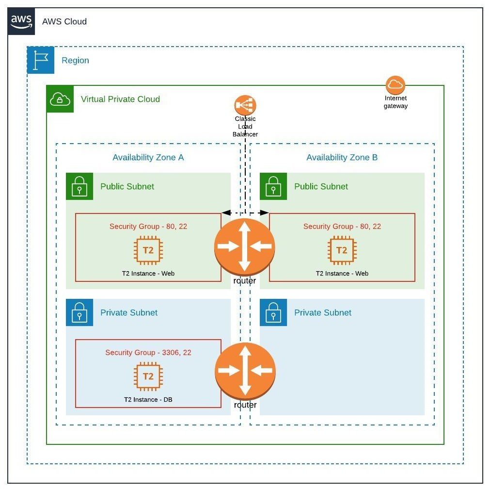

Mediawiki Installation on AWS using Ansible Playbook: 
========================================================


What's Covered:
----------------
 - Terraform Module that does the following: 
 	- 1 VPC
 	- 3 Subnets  
 	- 1 Keypair 
 	- 3 EC2 Instances - 2 Web and 1 DB
 	- 1 Elastic Load Balancer
   
 - Ansible Playbook that performs the following: 
    - Dynamically fetches your resources based on the tags you defined in the terraform IaC. 
    - Performs the Installation of the MySQL Database
    - Creates the Database and Users and other Validations. 
    - Encrypts the passwords into a vault. 
    - Role that installs Apache HTTPD, PHP from third-party repositories (remi, epel)
    - Configures the webserver
    - Makes it ready for the Launch on the browser. 

## Diagrams - Infra


## Diagram - Execution
1. Traffic arrives on load balancer and get routed to web servers in public subnet
2. Web servers can only make calls to DB server in private subnet


## Preparing Bastion Machine
Please refer to file - [master-setup-script.sh](master-setup-script.sh)
```
chmod 700 master-setup-script.sh
./master-setup-script.sh
```

## How to Execute Terrform commands
1. Clone and switch the directory to the Repository. 
	
	```git clone https://github.com/rohitsahuajm/mw_aws.git ```

2. Navigate to the folder: infra-on-aws-terraform:

	``` cd mw_aws```
	
3. Initialize the working directory.:

    ```terraform init -input=false```
	
4. Create a plan and save it to the local file tfplan: 

	```terraform plan -out=tfplan -input=false``` 
	
5. Apply the plan stored in the file tfplan.
	```terraform apply -input=false tfplan ``` 


## How to Execute Ansible Playbook independent of Terraform

```
ansible-playbook -i non-production master-install-mediawiki.yaml
```


## How to Secure Passwords
1. Open /etc/ansible/ansible.cfg
2. Update setting "vault_password_file" to point to a file where vault password is stored
3. [Reference](https://www.digitalocean.com/community/tutorials/how-to-use-vault-to-protect-sensitive-ansible-data-on-ubuntu-16-04)

## Things to consider
1. Check python version of destination machines. If version <= 3 then please comment "ansible_python_interpreter" in group_vars
2. Check if destination machine does not prompt during package upgrade. In my case grub prompt halted my ansible execution.
3. Pre-bake your image and provide ami-id in terraform.tfvars

For any questions, please write to me at rohitsahuajm[at].gmail.com
